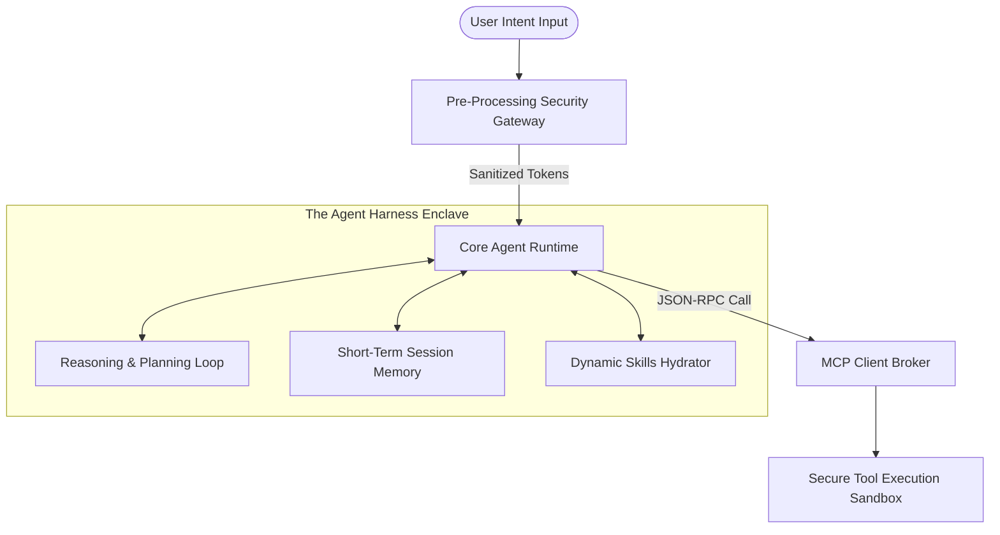
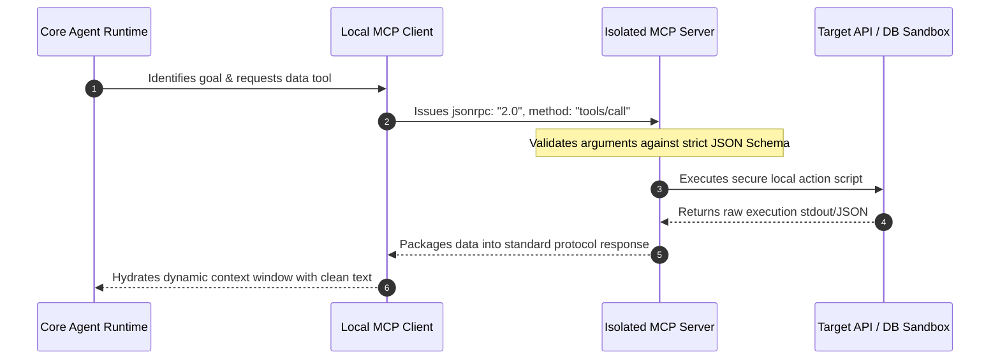
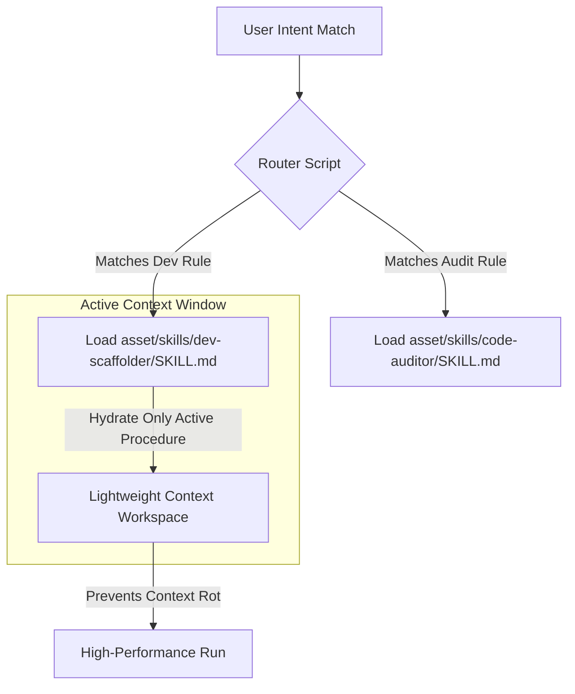
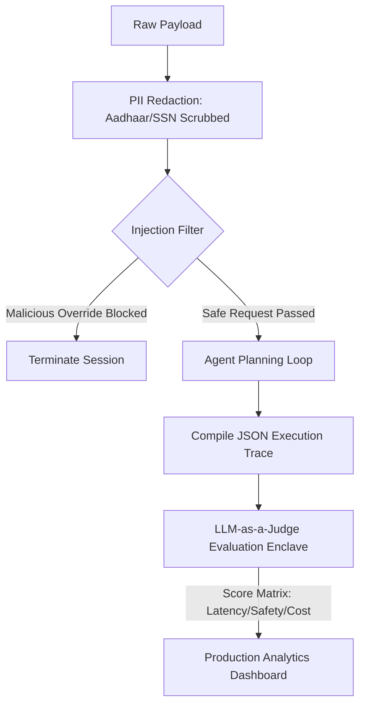
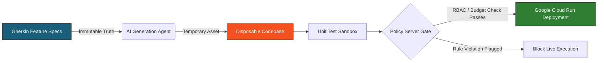

# Comprehensive System Architecture Blueprints

This module maps out the underlying software topologies, data flows, and security boundaries explored across each day of the 5-Day AI Agents course.

---

## Day 1: The Core Model-Harness Split & Context Flows
This diagram details how the core reasoning model is decoupled from operational system utilities using an isolated application harness.



---

## Day 2: The Model Context Protocol (MCP) Integration Layer

This sequence diagram tracks the asymmetrical client-server message transport layers navigating JSON-RPC protocol interfaces to eliminate custom integration glue code.



---

## Day 3: Dynamic Skill Packs & Progressive Disclosure

This blueprint details how massive system prompts are avoided by organizing operational behaviors into modular directories, loading explicit procedures only on demand.



---

## Day 4: Threat Modeling, PII Sanitization, & Evaluation Trajectories

This architecture maps the defensive perimeter (STRIDE parameters) alongside the automated target verification pipeline using advanced models as metrics judges.



---

## Day 5: Spec-Driven Development (SDD) & Policy Firewalls

This diagram traces how structural Gherkin criteria govern disposable code deployments while an isolated Policy Server authorizes or blocks live infrastructure execution.



```
